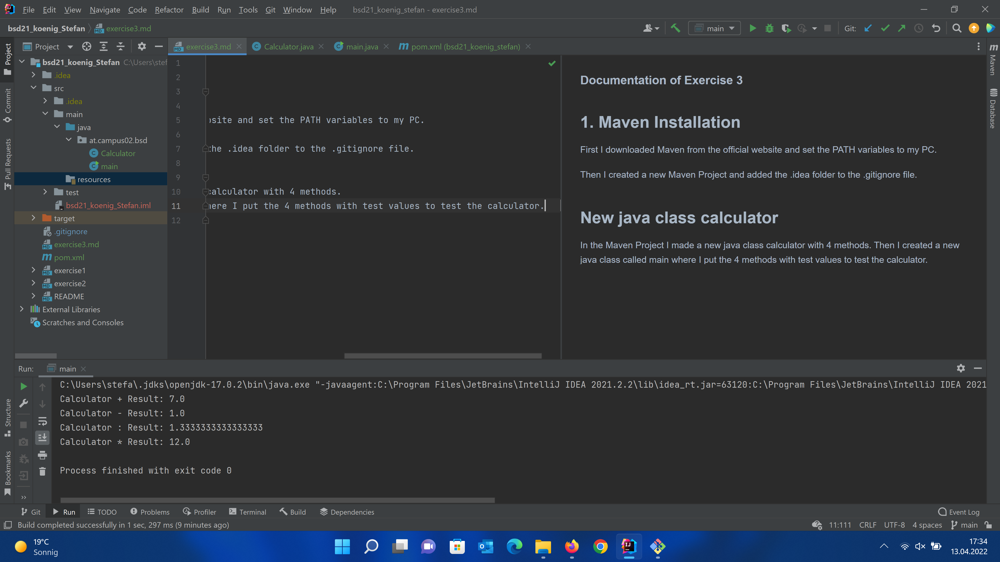
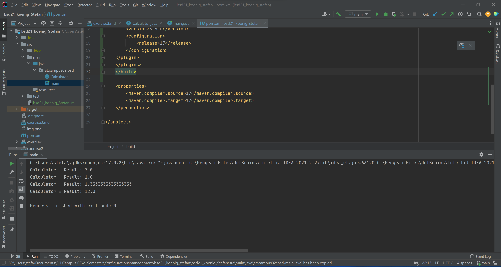

### Documentation of Exercise 3 ###

## 1. Maven Installation

First I downloaded Maven from the official website and set the PATH variables to my PC.

Then I created a new Maven Project and added the .idea folder to the .gitignore file.

## New java class calculator
In the Maven Project I made a new java class calculator with 4 methods.
Then I created a new java class called main where I put the 4 methods with test values to test the calculator.

Screenshot: 
I worked on this exercise a few days apart, so i do not really know anymore which folders where new after the first run.

Screenshot of program in console:

After that i commited my changes and pushed it to the repo.
