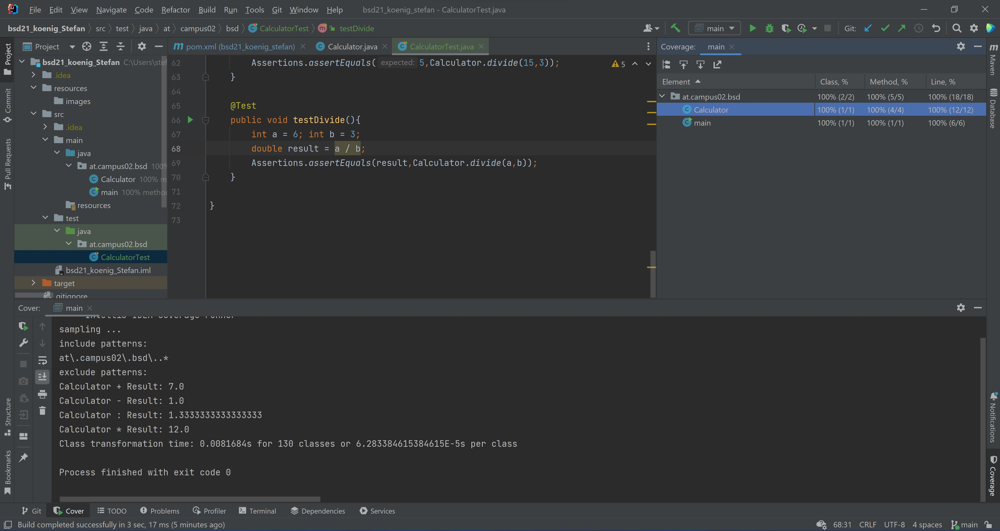

### Documentation of Exercise 4 ###

In my test forlder i created a CalculatorTest.java file with 8 Test methods to cover the add, minus, divide and multiply methods.

Here i made a screenshot of the Testcoverage.

